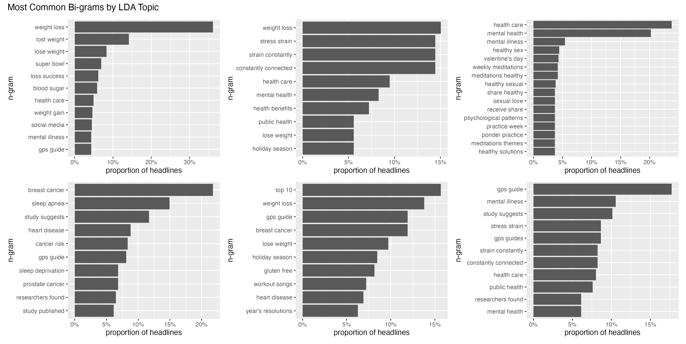

# Analysis of HuffPost Health & Wellness Headlines

### Dataset

The data used are a json dataset of news headlines, their 
categories, their post dates, and a brief description of the article
from HuffPost spanning 2012-2022. 

The data are originally available from here on Kaggle:
<https://www.kaggle.com/datasets/rmisra/news-category-dataset>

### Motivation 

For the past several years I have wanted to be able to perform analyses similar 
to this figure showing the rise-and-fall of topics in news headlines. 

Figure from <https://phys.org/news/2009-07-lipstick-pig-tracking-life.html>

I do not know of a way to automatically infer categories or clusters of 
topics that vary in length of words:  that is to say, it's easy to detect
what are topics that contain different words taken one at a time, or to 
detect frequent appearances of n-grams where n is fixed, but I do not know 
of methods that detect clusters where the foci of the clusters are phrases
of varying lengths. 

### Methods

I really couldn't have done this work without the fantastic open-source, free
online book by Julia Silge and David Robinson, *Tidy Text Mining with R*.

Check it out here: <https://www.tidytextmining.com/>

### Approach 

I realized that if I could use Latent Dirichlet Allocation models to 
define clusters to a corpus of text, I should be able to classify the 
pieces of text into which cluster they belong to, and then perform n-gram 
analysis.  This gets me closer to my original goal of detecting phrases
that are indicative of clusters within text bodies.

#### Minor Technical Details 

A few things became clear to me as I was analyzing the data:  First, it made
more sense to me to remove so-called "stopwords" (the, a, of, and, etc.) before 
analyzing n-grams. 

I also wasn't able to achieve my final goal of creating a streamgraph of topics
because of a couple of reasons:  1st it seems like the Latent Dirichlet Allocation
model makes the assumption that topics will be evenly represented in the data, 
so the data is naturally broken into roughly 6 evenly sized topics if n=6 is
specified.  2nd, the health and wellness articles turned out to be predominantly
from 2012-13, so there wasn't as much of a timespan over which I could study
them.

### Results 

First, this is what the Latent Dirichlet Allocation model outputs if we 
look at the top-10 most weighted terms within each topic: 

I find these are not very interpretable — I think one has to do a lot of 
staring (reading and re-reading) to try and figure out what these say. 

If we then take our LDA topics, assign each headline to a topic, and do n-gram 
analysis within each topic, I find the results much more compelling.  For example, 
what follows are the top bi-grams from each topic: 

These phrases indicate there are clusters of article headlines focused on: 

  * weight-loss (first two clusters)
    * the first being more focused on lost weight, blood sugar, etc., while the second is more
    focused on stress, strain and people feeling constantly connected.
  * health care and mental health
  * breast cancer, sleep apnea and other conditions, including "researchers found" and "study published" 
  * top 10 workout guides
  * "GPS guide" to mental illness 
  
Several of these clusters confirm what I already thought, which is that advice for 
losing weight has occupied a lot of space in popular wellness advice articles. Similarly, 
I'm not surprised that mental illness and mental health are popular topics as there
are so many articles I've seen about how to improve your mental health with meditation,
etc..  I'm also not surprised to see that the "top 10" article format is quantitatively 
popular. 

What did surprise me was the "GPS Guide" that I thought looked out of place. I 
found out after some light searching that HuffPost has had a ton of articles 
like "GPS Guide for Relieving Stress" — apparently these are another heading
that their health & wellness advice columns often appeared under. 

### Conclusions

I'm still dying to figure out how I can automate the identification of
topics and their focal phrases, especially where the number of words in the
phrase central to a given topic can have variable numbers of words in it.
However, I feel that combining the LDA and n-gram approach here made the results
from LDA significantly more interpretable and it feels like this is a step
forward in crafting machinery that will allow me and others to quantitatively
analyze free-text fields.